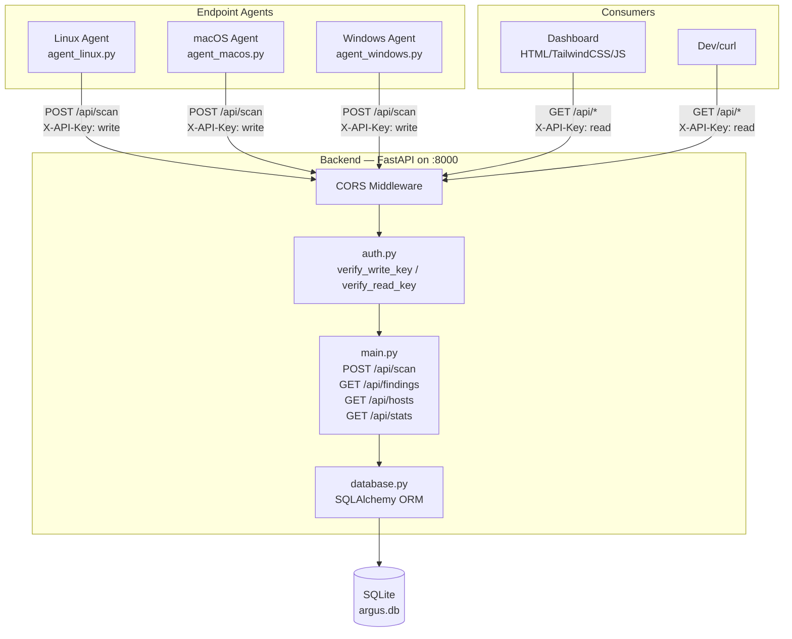
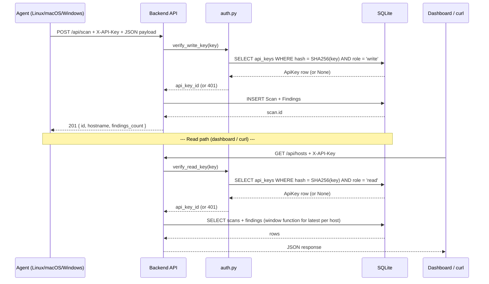

# CLAUDE.md

## Project Overview

**ARGUS** (AI Risk & Governance Unauthorized-endpoint Scanner) — a decentralized security framework that detects **Shadow AI** (unauthorized AI tools) across enterprise endpoints. Lightweight agents scan machines and report findings to a central FastAPI backend.

---

## Project Structure

```
ARGUS/
├── CLAUDE.md               ← This file
├── README.md               ← Team guide (start here)
├── backend/
│   ├── main.py             ← FastAPI app, routes, Pydantic models
│   ├── database.py         ← SQLAlchemy ORM, migrations, DB init
│   ├── auth.py             ← API key verification (SHA-256 hashing)
│   ├── seed.py             ← Seeds API keys from .env into DB
│   ├── test_data.py        ← Seeds sample scan data for dev
│   ├── requirements.txt    ← fastapi[standard], sqlalchemy
│   ├── Dockerfile          ← Python 3.12-slim, uvicorn entrypoint
│   ├── .env.example        ← API key template (committed)
│   ├── .env                ← Real keys (gitignored)
│   └── data/argus.db       ← SQLite database (gitignored)
├── docs/
│   ├── payload-schema.json ← JSON Schema for agent payloads
│   ├── example-payload.json
│   ├── backend-plan.md     ← DB schema, API docs, testing guide
│   ├── architecture.md     ← Mermaid diagrams: system, sequence, ERD, auth flow
│   └── deployment-guide.md ← Docker multi-arch build, VPS deploy
├── agents/
│   └── agent_macos.py      ← macOS agent: detects Ollama, Cursor, MCP configs
└── venv/                   ← Python 3.12 virtualenv (gitignored)
```

**Not yet implemented**: `agents/agent_linux.py`, `agents/agent_windows.py`, and `dashboard/` are referenced throughout the docs and diagrams but don't exist in the repo yet. When building them, follow the Payload Contract below exactly — the backend already expects it.

---

## Tech Stack

| Layer       | Technology                     |
|-------------|---------------------------------|
| Backend     | FastAPI, Uvicorn               |
| ORM         | SQLAlchemy (DeclarativeBase)   |
| Database    | SQLite (WAL mode)              |
| Auth        | SHA-256 hashed API keys        |
| Deployment  | Docker, Docker BuildX (multi-arch: amd64 + arm64) |
| Dashboard   | HTML, TailwindCSS, Vanilla JS *(planned)* |

---

## Architecture

### System Diagram



### Data Flow



---

## API Endpoints

| Method | Path                | Auth Role | Description                                               |
|--------|---------------------|-----------|-----------------------------------------------------------|
| `GET`  | `/health`           | None      | Health check                                              |
| `POST` | `/api/scan`         | write     | Ingest agent scan payload (create Scan + Findings)        |
| `GET`  | `/api/findings`     | read      | List scans with nested findings (filterable, paginated)   |
| `GET`  | `/api/findings/{id}`| read      | Single scan detail with all findings                      |
| `GET`  | `/api/hosts`        | read      | Unique hosts with latest scan + severity summary          |
| `GET`  | `/api/stats`        | read      | Aggregate counts (hosts, findings by severity)            |

### Query Parameters (GET /api/findings)

| Param      | Type | Default | Description               |
|------------|------|---------|---------------------------|
| `hostname` | str  | None    | Filter by exact hostname  |
| `severity` | str  | None    | Filter by severity level  |
| `limit`    | int  | 50      | Max results (1–200)       |
| `offset`   | int  | 0       | Pagination offset         |

---

## Database Schema

### `api_keys`
| Column     | Type     | Notes              |
|------------|----------|--------------------|
| id         | int PK   | auto-increment     |
| key_hash   | str      | SHA-256 hash       |
| name       | str      | e.g. "linux-agent" |
| role       | str      | "write" or "read"  |
| is_active  | bool     | toggle             |
| created_at | datetime | UTC                |

### `scans`
| Column        | Type    | Notes                      |
|---------------|---------|----------------------------|
| id            | int PK  | auto-increment             |
| hostname      | str     | indexed                    |
| os            | str     | linux / darwin / windows   |
| os_version    | str     | e.g. "Ubuntu 22.04 LTS"   |
| kernel        | str     | nullable                   |
| agent_version | str     | semver                     |
| scanned_at    | datetime| from agent payload         |
| uptime_seconds| int     | nullable                   |
| ip_address    | str     | nullable                   |
| api_key_id    | int FK  | → api_keys.id              |
| received_at   | datetime| server-set UTC timestamp   |

### `findings`
| Column      | Type    | Notes                                     |
|-------------|---------|-------------------------------------------|
| id          | int PK  | auto-increment                            |
| scan_id     | int FK  | → scans.id (cascade delete)              |
| category    | str     | local_llm / ai_ide / mcp_server          |
| name        | str     | tool name (ollama, cursor, mcp_config)   |
| severity    | str     | high / medium / low                       |
| status      | str     | detected / not_detected                   |
| evidence    | str     | human-readable description                |
| pid         | int     | nullable                                  |
| port        | int     | nullable                                  |
| path        | str     | nullable, file path                       |
| user        | str     | nullable, username                        |
| detected_at | datetime| from agent payload                        |

### Auto-Migration

`database.py` runs `PRAGMA table_info()` at startup and applies any missing columns from the `MIGRATIONS` list via `ALTER TABLE`. New schema changes should be appended to `MIGRATIONS` in `database.py`.

---

## Authentication

API key auth uses **SHA-256 hashing** — plaintext keys are never stored in the database.

**Flow:**
1. Client sends `X-API-Key: <plaintext>` in HTTP header
2. Backend hashes with `hashlib.sha256(plaintext.encode()).hexdigest()`
3. Looks up hash in `api_keys` table, checks role matches endpoint requirement
4. Returns `401 Unauthorized` if hash not found, key inactive, or role mismatch

**Key Roles:**
- `write` — required for `POST /api/scan` (agent writes)
- `read` — required for all `GET /api/*` endpoints (dashboard reads)

**API Keys:**
| Env Variable        | Role  | Used By           |
|---------------------|-------|--------------------|
| `ARGUS_KEY_TEST`    | write | Local dev / curl   |
| `ARGUS_KEY_LINUX`   | write | Linux agent        |
| `ARGUS_KEY_MACOS`   | write | macOS agent        |
| `ARGUS_KEY_WINDOWS` | write | Windows agent      |
| `ARGUS_KEY_DASHBOARD`| read  | Dashboard JS       |

---

## Quick Start (Local Development)

```bash
cd backend
python3 -m venv ../venv
source ../venv/bin/activate
pip install -r requirements.txt

cp .env.example .env   # edit with real keys
python seed.py          # seed API keys from .env
python test_data.py     # seed 5 sample hosts with findings

uvicorn main:app --reload --port 8000

# In another terminal:
curl http://localhost:8000/health
curl -H "X-API-Key: <read-key>" http://localhost:8000/api/stats
```

---

## Docker

### Local Build (single arch)
```bash
cd backend
docker build -t argus-backend:latest .
docker run -d -p 8000:8000 \
  -v argus-data:/app/data \
  --restart unless-stopped \
  argus-backend:latest
```

### Multi-Arch Build (for VPS with arm64)
```bash
cd backend
docker buildx create --name multiarch --use
docker buildx build \
  --platform linux/amd64,linux/arm64 \
  -t <dockerhub-user>/argus-backend:latest \
  --push .
```

### First-Time VPS Setup
```bash
# Create .env on VPS
mkdir -p ~/argus-config
# Edit ~/argus-config/.env with production keys

# Pull and run
docker pull <dockerhub-user>/argus-backend:latest
docker run -d \
  -p 8000:8000 \
  -v argus-data:/app/data \
  -v ~/argus-config/.env:/app/.env:ro \
  --restart unless-stopped \
  <dockerhub-user>/argus-backend:latest

docker exec <container-id> python seed.py
```

---

## Key Design Decisions

1. **SQLite over PostgreSQL** — lightweight, zero-config; sufficient for a 5-person team project on a small VPS
2. **SHA-256 key hashing** — plaintext never touches the DB; simple but effective for non-production use
3. **Separate read/write roles** — agents can only POST, dashboard can only GET
4. **Auto-migration at startup** — avoids manual `ALTER TABLE` when deploying new columns
5. **Docker volume for data** — persists across container restarts/redeploys

---

## Common Pitfalls

- **`/api/scan` uses write key; `/api/*` GET endpoints use read key** — mixing them returns 401
- **CORS is `allow_origins=["*"]`** — lock this down in production
- **Seed must run after first container start** — `python seed.py` inside container before API works
- **`.env` is gitignored** — never commit it; only `.env.example` is in the repo
- **Database lives in Docker volume `argus-data`** — deleting the container without the volume flag loses data
- **`requirements.txt` is missing `python-dotenv`** — `seed.py` and `test_data.py` both `import dotenv`, but it's not pinned; install it manually (`pip install python-dotenv`) if seeding fails with `ModuleNotFoundError`

---

## Team Roles

| Member | Area | Files |
|--------|------|-------|
| Member 1 (Backend) | API + DB | `backend/*` |
| Member 2 | Agent (Linux) | `agents/agent_linux.py` |
| Member 3 | Agent (macOS) | `agents/agent_macos.py` |
| Member 4 | Agent (Windows) | `agents/agent_windows.py` |
| Member 5 | Dashboard | `dashboard/` |

---

## Payload Contract

All agents send identical JSON to `POST /api/scan`. Full schema: `docs/payload-schema.json`

**Required fields:** `hostname`, `os`, `os_version`, `kernel`, `agent_version`, `scanned_at`, `findings[]`

**Finding categories:** `local_llm` (Ollama), `ai_ide` (Cursor), `mcp_server` (MCP config files)

**Severity levels:** `high`, `medium`, `low`

**Finding status:** `detected` or `not_detected`

---

## Development Notes

- Virtualenv lives at project root `venv/`, not inside `backend/`
- The `database.py` auto-creates `backend/data/` directory and `argus.db` file on first import
- `uvicorn --reload` watches `backend/` for changes — good for rapid iteration
- `seed.py` is idempotent — running it twice skips existing keys
- `test_data.py` assumes `seed.py` has been run first
- **No automated test suite or linter is configured yet** — verify changes by running the server and exercising endpoints with `curl` (see Quick Start), not by looking for a `pytest`/`ruff` command that doesn't exist
