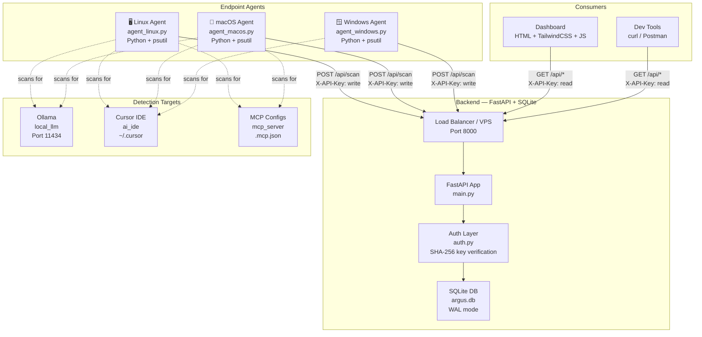
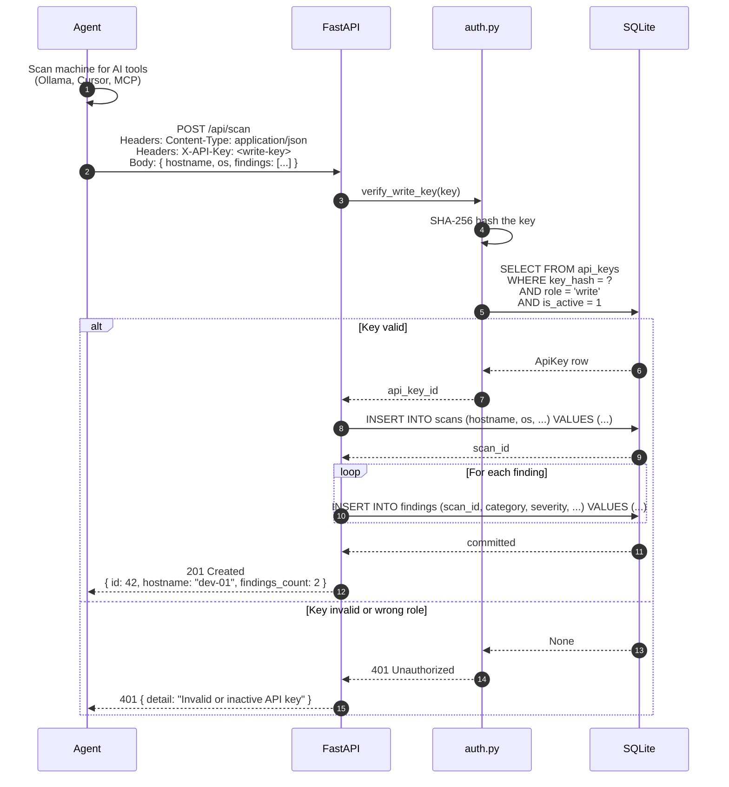
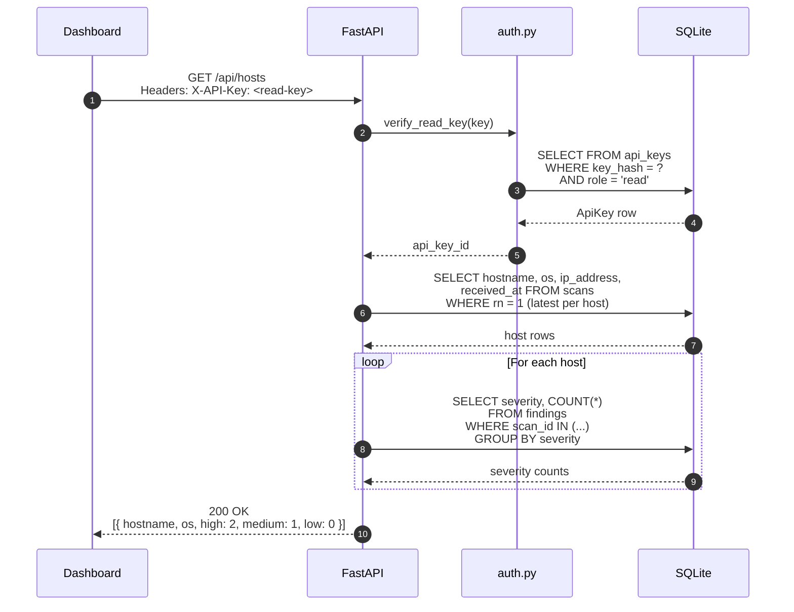
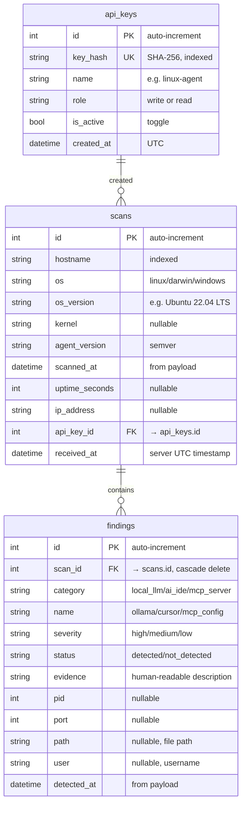
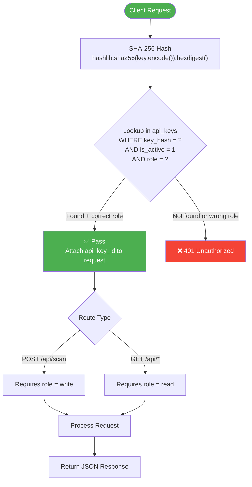
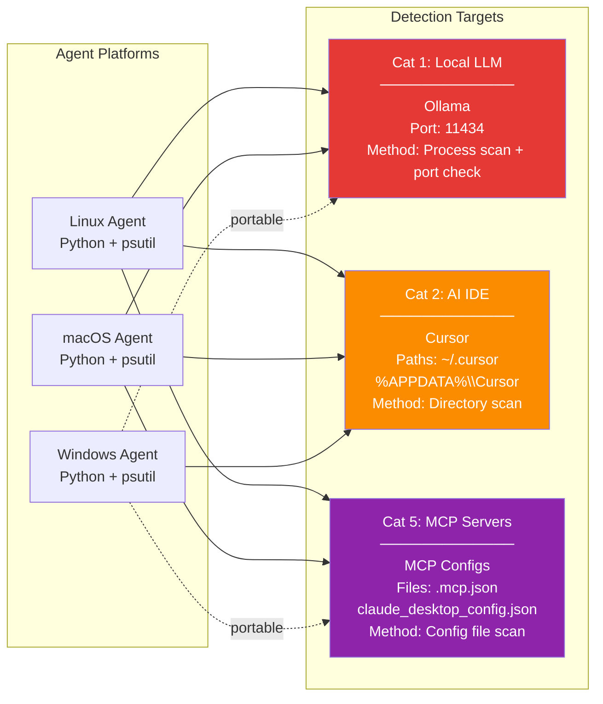
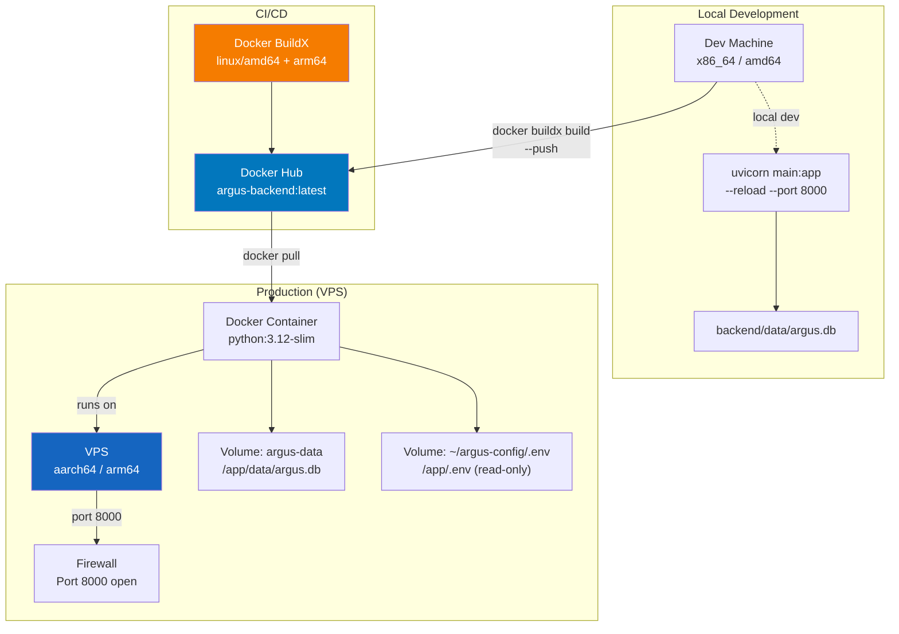

# ARGUS Architecture

**AI Risk & Governance Unauthorized-endpoint Scanner**

A decentralized security framework that detects **Shadow AI** (unauthorized AI tools) across enterprise endpoints.

---

## System Overview

---

## Request/Response Flow

### Scan Ingestion (Agent → Backend)

### Dashboard Read (Dashboard → Backend)

---

## Database Schema

---

## Authentication Flow

---

## Agent Detection Matrix

---

## Deployment Architecture

---

## Environment Variables

| Variable            | Purpose                              | Example Value               |
|---------------------|--------------------------------------|------------------------------|
| `ARGUS_KEY_TEST`    | Write key for local dev / curl       | `test-secret-key-abc123`    |
| `ARGUS_KEY_LINUX`   | Write key for Linux agent            | `linux-agent-key-xyz789`    |
| `ARGUS_KEY_MACOS`   | Write key for macOS agent            | `macos-agent-key-uvw456`    |
| `ARGUS_KEY_WINDOWS` | Write key for Windows agent          | `windows-agent-key-rst123`  |
| `ARGUS_KEY_DASHBOARD`| Read key for dashboard              | `dashboard-read-key-opq987` |
| `ARGUS_DB_DIR`      | Override DB directory (optional)     | `/custom/path`              |

---

## Summary

| Component     | Role                                          | File(s)                         |
|---------------|-----------------------------------------------|---------------------------------|
| **Agents**    | Scan endpoints for Shadow AI, POST findings   | `agents/*.py`                   |
| **Backend**   | Ingest, store, query scan data                | `backend/main.py`               |
| **Auth**      | Verify API keys via SHA-256 hashing           | `backend/auth.py`               |
| **Database**  | Persist scans + findings (SQLite)             | `backend/database.py`           |
| **Seeders**   | Initialize API keys + test data               | `backend/seed.py`, `test_data.py` |
| **Dashboard** | Visualize hosts, findings, risk scores        | `dashboard/` (planned)          |
| **Docker**    | Multi-arch containerized deployment           | `backend/Dockerfile`            |

---

*Last updated: July 2025*
