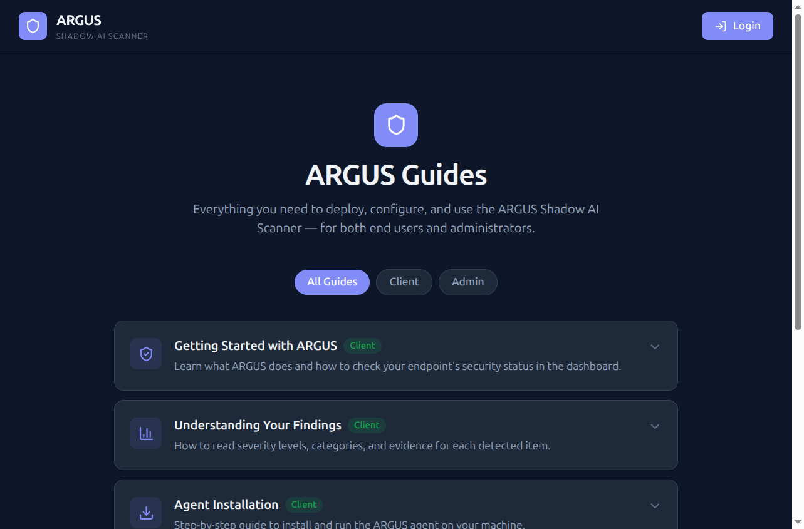

# ARGUS Dashboard

React + Vite frontend for the ARGUS Shadow AI Scanner. Talks to the
FastAPI backend (`../backend/`) over `GET /api/*`, authenticated with
the dashboard's read-role API key.



## Local development

```bash
npm install
cp .env.example .env
# edit .env — set VITE_API_URL to your backend, e.g. http://localhost:8000
npm run dev
```

Leave `VITE_ARGUS_API_KEY` blank in `.env` to sign in through the
login page instead (see below) — this is the closer-to-production
path and avoids the key sitting in the built bundle.

## Login

Visiting any page without an active session redirects to `/login`,
which prompts for the dashboard read key (`ARGUS_KEY_DASHBOARD` from
the backend's `.env`/seed). The key is validated against
`GET /api/stats` before being accepted, then kept in `sessionStorage`
for the rest of the browser tab's life — it is cleared on tab close or
by the "Log out" button in the sidebar.

There are no user accounts; this is a single shared secret gate, same
as every other ARGUS client (agents, curl, etc.) — it doesn't add a
new credential, just moves the existing dashboard key from build-time
config into a runtime prompt.

If `VITE_ARGUS_API_KEY` is set (build time or `.env` in dev), it's used
as a fallback and the login page is bypassed entirely — useful for
local dev, not recommended for a shared deployment since the key would
be visible in the served JS bundle.

## Docker

Vite inlines `VITE_*` env vars into the JS bundle at **build time**, so
they must be passed as `--build-arg`, not mounted as a runtime `.env`
(unlike the backend container). `VITE_API_URL` is required — without
it every request has nowhere to go. `VITE_ARGUS_API_KEY` is optional:
omit it and users sign in through the login page at runtime instead of
having the key baked into the bundle.

```bash
docker build \
  --build-arg VITE_API_URL=http://134.185.94.34:8000 \
  -t argus-frontend:latest .

docker run -d -p 80:80 --restart unless-stopped argus-frontend:latest
```

If you build without `VITE_API_URL`, the app ships with an empty API
URL baked in and every request will fail — rebuild the image to change
it, restarting the container alone won't pick up a new value.

For the VPS (arm64), follow the same multi-arch pattern as the backend
(see `docs/deployment-guide.md`):

```bash
docker buildx build \
  --platform linux/amd64,linux/arm64 \
  --build-arg VITE_API_URL=http://134.185.94.34:8000 \
  -t <dockerhub-user>/argus-frontend:latest \
  --push .
```

The container serves the built static files via nginx on port 80 and
falls back to `index.html` for client-side routes (`nginx.conf`).
